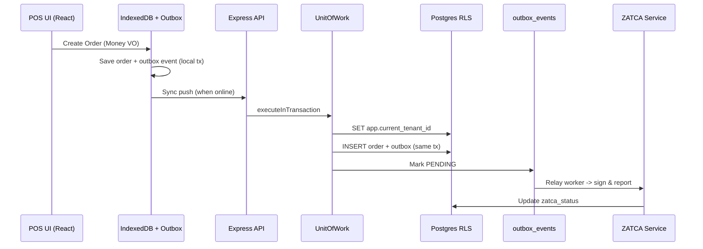

# Blueprint المعماري الثابت - OmniPOS Cloud

## 1. النمط المعماري: Modular Monolith + Hexagonal (Ports & Adapters)

**القرار:** نبدأ كـ Modular Monolith وليس Microservices.

**لماذا؟**
- Microservices مبكراً = تعقيد تشغيلي، Transactions موزعة، تكلفة عالية.
- Modular Monolith يعطينا حدود واضحة (Bounded Contexts) مع إمكانية فكها لاحقاً لخدمات مستقلة.
- كل Module له: `domain/` (pure logic), `application/` (use cases), `infrastructure/` (adapters), `presentation/` (controllers/routes).

```
src/
├── foundation/              # الأساس الثابت - لا يعتمد على أي دومين
│   ├── core/                # Money, Decimal, Result, DomainEvent, Errors
│   ├── tenancy/             # TenantContext, TenantResolver, RLS
│   └── security/            # AuthPipeline, RBAC/ABAC
│
├── domain/                  # كل Bounded Contexts
│   ├── organization/        # Org Hierarchy (NEW)
│   ├── company/             # Company Legal Entity (NEW)
│   ├── branch/
│   ├── catalog/
│   ├── inventory/
│   ├── pos/                 # Order, OrderItem, Payment
│   ├── shift/
│   ├── accounting/
│   ├── zatca/
│   └── ...
│
├── application/             # Use Cases (Orchestration)
│   ├── pos/
│   │   ├── CreateOrderUseCase
│   │   ├── PayOrderUseCase
│   │   └── CloseShiftUseCase
│   └── company/
│       ├── ProvisionCompanyUseCase
│       └── ...
│
├── infrastructure/
│   ├── db/                  # Postgres adapters, Repositories
│   ├── edge/                # IndexedDB adapters
│   └── external/            # ZATCA API, Payment Gateway
│
└── presentation/
    ├── http/                # Express controllers/routes
    └── workers/             # Outbox relay, Sync workers
```

### قاعدة الاعتماد (Dependency Rule):
`domain` لا يعرف شيئاً عن `infrastructure` أو `presentation`. فقط يعتمد على `foundation/core`.
`application` يعتمد على `domain` + `foundation`.
`infrastructure` يطبق interfaces من `domain`.

## 2. الهيكل الطبقي الثابت

```
┌─────────────────────────────────────────────┐
│ Presentation (React 19 + Express Routes)    │
├─────────────────────────────────────────────┤
│ Application (UseCases, Sagas, DTOs)         │
├─────────────────────────────────────────────┤
│ Domain (Entities, VOs, Aggregates, Rules)   │
├─────────────────────────────────────────────┤
│ Foundation (Money, Tenant, Security, Event) │  <-- لا يتغير أبداً
├─────────────────────────────────────────────┤
│ Infrastructure (Postgres, IndexedDB, APIs)  │
└─────────────────────────────────────────────┘
```

## 3. نماذج الشركات - 3 مستويات (اقتراحك المطلوب)

### المستوى 1: Single Company (الحالي)
```
Tenant (Org) = Company واحدة
  └── Branches (فروع)
       └── Terminals
```
- مناسب لمطعم/مقهى 1-10 فروع
- كل Tenant له VAT واحد، CoA واحد

### المستوى 2: Multi-Company Holding (الاقتراح الأساسي)
```
Tenant (Organization / Holding)
  ├── Company A (سجل تجاري + VAT مستقل)
  │    ├── Branch A1, A2
  │    └── Warehouse A
  ├── Company B (VAT مختلف)
  │    └── Branch B1
  └── Shared Services
       ├── Central Kitchen
       ├── Procurement Center
       └── HR Pool
```
**القرار المعماري:**
- `tenants` table = Organization (القابضة)
- `companies` table جديد = Legal Entity (سجل تجاري + VAT)
- `branches.company_id` + `branches.tenant_id`
- `chart_of_accounts.company_id` (كل شركة لها شجرة حسابات مستقلة لكن يمكن تجميعها Consolidated)
- `zatca_config` على مستوى Company وليس Tenant

**الميزة:** عميل واحد (مجموعة مطاعم) يدير 3 علامات تجارية (Brands) كل واحدة شركة قانونية مختلفة، بفاتورة SaaS واحدة.

### المستوى 3: Franchise Network
```
Franchisor Tenant (مالك العلامة)
  ├── Corporate Menu Template
  ├── Royalty Rules (5%)
  └── Compliance Policies

Franchisee Tenant (مستقل، لكن مرتبط)
  ├── Linked to Franchisor via franchise_agreements
  ├── Receives menu distributions
  └── Pays royalties (auto-calculated)
```
- كل Franchisee هو Tenant مستقل (عزل كامل)
- لكن يوجد `franchise_relationships` table تربطهم

**جدول القرار:**
| الميزة | Single Company | Multi-Company | Franchise |
|---|---|---|---|
| عزل بيانات | RLS على tenant_id | RLS على tenant_id + company_id | Tenant منفصل |
| ZATCA | VAT واحد | VAT لكل Company | VAT لكل Franchisee |
| فاتورة SaaS | واحدة | واحدة مجمعة | كل Franchisee فاتورة |
| Menu | واحد | يمكن مشاركة أو مستقل | توزيع مركزي |

## 4. مكونات POS الأساسية (Core Aggregates)

### Order Aggregate (الجذر)
```ts
// Aggregate Root
class Order {
  id: OrderId
  companyId: CompanyId  // NEW
  branchId: BranchId
  status: OrderStatus
  items: OrderItem[]     // Entities
  payments: Payment[]    // Entities
  totals: OrderTotals    // VO (Money)
  zatcaState: ZatcaState // VO

  // Invariants (قواعد لا يمكن كسرها):
  // - لا يمكن دفع أكثر من الإجمالي
  // - لا يمكن إغلاق طلب بدون Shift مفتوح
  // - Money currency = Company currency
}
```

### Shift Aggregate
- يضمن أن الكاشير لا يفتح ورديتين
- يحسب الفروقات (Expected vs Actual)
- يولد Z-Report ويقفل بـ Journal Entry

### Inventory Aggregate
- `currentStock` محفوظ كـ JSONB لكن التعديل عبر `adjustStock` فقط (Domain Method)
- يمنع البيع إذا المخزون سالب (حسب Policy)

## 5. نمط المزامنة Offline-First

```
[POS Terminal - Browser IndexedDB]
   |
   | write -> outbox (local)
   |        -> vector_clock { terminalId: version }
   |
   v
[Sync Service - Background Worker]
   |
   |-- POST /api/sync/push (batch outbox_events)
   |-- GET /api/sync/pull?since=vector
   |
   v
[Postgres - Server]
   -> outbox_events (server) -> outbox relay -> consumers
   -> CRDT merge (Last-Write-Wins with vector clock + business rules)
```

**قرار:** نستخدم LWW + Vector Clock وليس CRDT معقد. التعارض في الطلبات نادر، وعند التعارض: Server Wins للـ Orders، لكن Inventory يحتاج manual reconciliation.

## 6. Tech Stack الثابت

| الطبقة | التقنية | السبب |
|---|---|---|
| Runtime | Node 22 + Express 4 + tsx | موجود، خفيف، يكفي لـ Modular Monolith |
| DB | Postgres 16 + RLS + pg | عزل مستأجرين على مستوى DB، JSONB مرن |
| Edge DB | IndexedDB + fake-indexeddb للاختبار | Offline |
| Frontend | React 19 + Vite + Tailwind 4 | موجود |
| Money | Custom Money VO + Decimal | لا float للفلوس |
| Auth | HMAC-SHA256 signed token (موجود) | بسيط، لا JWT library ثقيل |
| Validation | Zod (مقترح) | Type-safe |
| Observability | Pino logger + OpenTelemetry (مقترح) | Structured logs |

## 7. مخطط Mermaid - تدفق طلب


